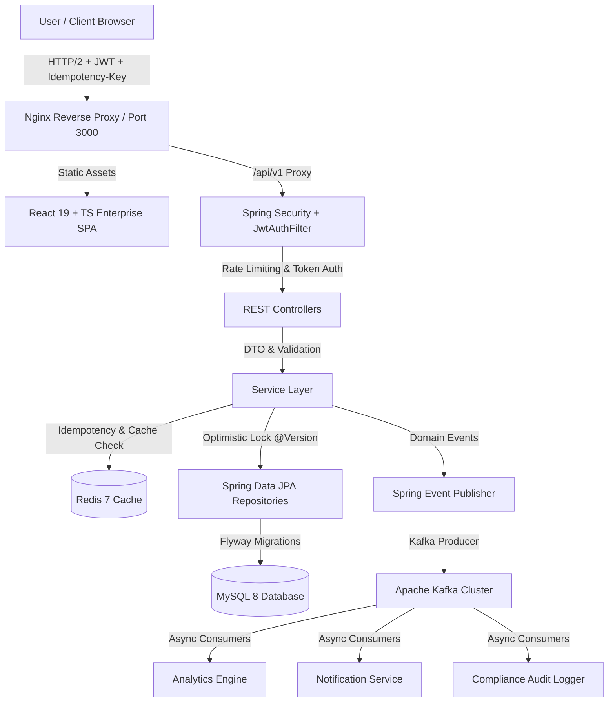

# 🚀 Smart Expense Manager V2 – Premium Enterprise FinTech Platform

[](https://spring.io/projects/spring-boot)
[](https://www.oracle.com/java/)
[](https://react.dev/)
[](https://www.typescriptlang.org/)
[](https://vitejs.dev/)
[](https://tailwindcss.com/)
[](https://www.mysql.com/)
[](https://redis.io/)
[](https://kafka.apache.org/)
[](https://www.docker.com/)

An **enterprise-grade, high-performance, AI-native financial management platform** built with a modern React 19 TypeScript frontend and a scalable Spring Boot 3 Java 21 microservice backend. Smart Expense Manager V2 provides modern financial experience comparable to **Stripe, Linear, Ramp, Mercury, and Notion**.

---

## 📌 Full-Stack Architecture Blueprint



---

## ⚙️ Tech Stack & Systems

| Layer | Technology | Purpose |
|---|---|---|
| **Frontend Framework** | React 19, TypeScript, Vite 8 | Premium FinTech SPA, Dark glassmorphism, responsive grid |
| **Styling & UI** | Tailwind CSS v4, Lucide Icons, Recharts | Enterprise design system, interactive financial charts |
| **Backend Core** | Java 21, Spring Boot 3.3.2 | High-concurrency microservice engine & dependency injection |
| **Security & Auth** | Spring Security, JWT, BCrypt | Stateless Authentication, Token Rotation, 2FA, Session Management |
| **Database** | MySQL 8.0, Spring Data JPA | Relational persistence, connection pooling (HikariCP), B-Tree indexes |
| **Database Migrations**| Flyway Migration | Version-controlled database schema migrations (`V1`, `V2`) |
| **Caching & Rate Limit**| Redis 7, Spring Cache | Low-latency response caching (<100ms) & Token Bucket rate limiting |
| **Event Streaming** | Apache Kafka 3.7 (KRaft) | Asynchronous domain event publishing & consumer decoupling |
| **AI Advisory Engine** | Rule Engine + OpenAI Integration | Cashflow velocity analysis, automatic merchant categorization, AI query engine |
| **Observability** | Actuator, Micrometer, Prometheus, Grafana | Real-time health probes, JVM metrics, custom metric dashboards |
| **Containerization** | Docker, Nginx, Docker Compose | Multi-stage container builds & full-stack 1-command orchestration |

---

## 🔥 Feature Highlights

### 🎨 Frontend & Application Features
1. **Interactive Dashboard**: Real-time cashflow velocity charts, 4 interactive KPI cards, budget health indicator, and recent transaction table.
2. **Transactions & Outflows**: Column sorting, pagination, date/amount range filters, multi-select bulk operations, and CSV export.
3. **Category Budget Planner**: Set and adjust monthly spending caps per category, over-limit alerts, and interactive `BudgetModal`.
4. **Financial Analytics**: Trajectory charts, category breakdown pie charts, and printable PDF reports.
5. **AI Copilot Drawer & Page**: Interactive AI financial advisor for natural language queries and spending forecasting.
6. **Command Palette (`Ctrl+K`)**: Global search & quick execution launcher covering all navigation targets and actions.
7. **Notification Center**: Real-time notification drawer with unread badges, mark all read, and filterable alert types.
8. **Settings Suite**: Profile management with avatar upload, security settings with password strength meter & 2FA, appearance controls, active session revocation, API key generation/copying/revocation, multi-format data export (CSV, JSON, PDF, Excel), and danger zone actions.

### 🛡️ Enterprise Backend & Security
1. **Idempotent API Transactions**: SHA-256 fingerprinting on `Idempotency-Key` headers prevents duplicate billing or expense entries.
2. **Concurrency Control**: JPA `@Version` optimistic locking prevents race conditions under high concurrent traffic.
3. **Event-Driven Microservices**: Asynchronous Kafka consumers for analytics, notifications, and compliance logging.
4. **Token Bucket Rate Limiting**: In-memory and Redis-backed rate limiting to defend against brute force and DDoS attacks.

---

## 🐳 Quick Start with Docker Compose

Spin up the complete full-stack environment (React Frontend, Spring Boot App, MySQL 8, Redis 7, Kafka, Kafka UI, Prometheus, Grafana) with a single command:

```bash
docker compose up --build -d
```

### 🌐 Service Endpoints:
- 💻 **Frontend Web App**: `http://localhost:3000`
- ⚙️ **Spring Boot API**: `http://localhost:8080`
- 📚 **Swagger API Docs**: `http://localhost:8080/swagger-ui.html`
- 📊 **Kafka UI**: `http://localhost:8085`
- 📈 **Prometheus Metrics**: `http://localhost:9090`
- 📉 **Grafana Dashboard**: `http://localhost:3001` (User: `admin` / Password: `admin`)

---

## 💻 Local Development Setup

### 1. Frontend Setup
```bash
cd frontend
npm install
npm run dev
```
Access dev server at: `http://localhost:3000`

### 2. Backend Setup
```bash
mvn clean install
mvn spring-boot:run
```

---

## 🚀 Build & Production Verification

```bash
# Frontend production build check
cd frontend && npm run build

# Backend unit & integration tests
mvn clean test
```

---

## 📜 License

This project is licensed under the Apache 2.0 License.
